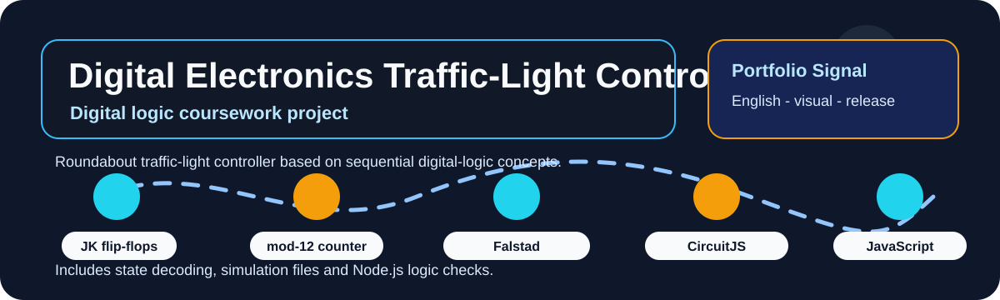

# Digital Electronics Roundabout Traffic-Light Controller

  
  
  

  

## Overview

This repository documents a roundabout traffic-light controller built from sequential digital-logic concepts and packaged for engineering review.

| Field | Details |
|---|---|
| Repository | [DienTuSo](https://github.com/lhlizdabezt/DienTuSo) |
| Portfolio category | Digital electronics coursework project |
| Primary stack | Digital logic, JK flip-flops, counters, Falstad/CircuitJS, JavaScript, Node.js, report assets. |
| Latest release | [GitHub Releases](https://github.com/lhlizdabezt/DienTuSo/releases/latest) |
| Tags | [Version tags](https://github.com/lhlizdabezt/DienTuSo/tags) |
| Owner profile | [Luong Hai Long](https://github.com/lhlizdabezt) |

## Reviewer Map

| What to Review | Where to Look | Why It Matters |
|---|---|---|
| Technical scope | This README and source tree | Gives a quick, bounded reading path before opening every file |
| Evidence assets | Release page and top-level project files | Shows what can be downloaded or inspected quickly |
| Implementation material | Source folders, scripts, notebooks or design files | Connects the portfolio claim to real project artifacts |
| Version history | Tags and release notes | Makes the repository easier to audit over time |

## Evidence Highlights

- Mod-12 counter and JK flip-flop state machine.
- State decoding for multi-direction traffic-light behaviour.
- Falstad/CircuitJS simulation evidence and Node.js logic tests.
- Motion GIF, video/report release assets and reviewer-oriented README structure.

## Repository Structure

| Path | Purpose |
|---|---|
| `assets/` | Top-level directory included in the repository |
| `scripts/` | Top-level directory included in the repository |
| `tools/` | Top-level directory included in the repository |
| `roundabout_stable_counter_falstad_url.txt` | Top-level file included in the repository |
| `roundabout_traffic_light_controller_falstad_demo_clean.txt` | Top-level file included in the repository |
| `roundabout_traffic_light_controller_falstad_stable_counter.txt` | Top-level file included in the repository |
| `start-circuitjs-demo.cmd` | Top-level file included in the repository |
| `start-circuitjs-stable-counter.cmd` | Top-level file included in the repository |

## Scope and Boundaries

Coursework prototype for digital-electronics review. It demonstrates logic design and simulation discipline, not a field-deployed traffic controller.

## Role and Portfolio Context

Luong Hai Long organized the repository, evidence flow, release assets and portfolio-facing documentation.

## Release and Tagging Notes

This repository is maintained as part of an English-facing engineering portfolio. Releases and tags are used to preserve reviewable snapshots of the project, including source state, documentation updates and any available visual or report assets.

## Writing Standard

The README follows an evidence-first style: direct technical nouns, clear project boundaries, release-backed artifacts and no inflated claims beyond what the repository can support.
