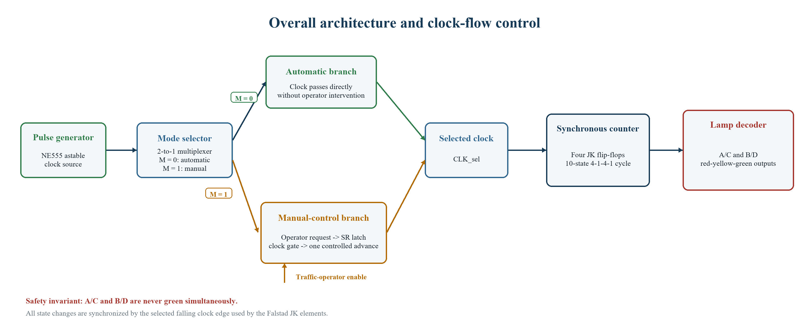
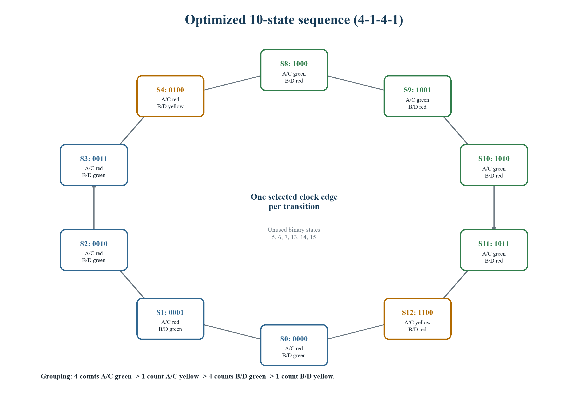
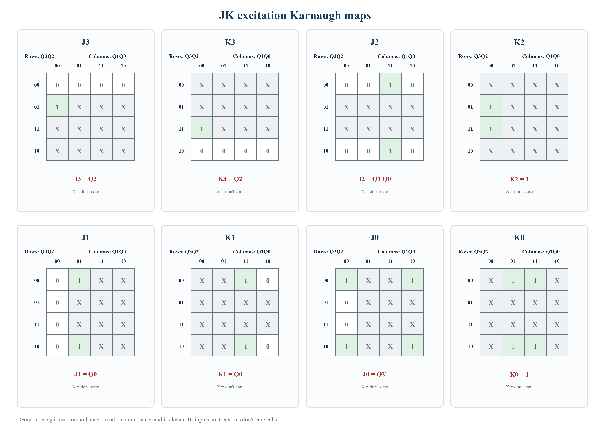
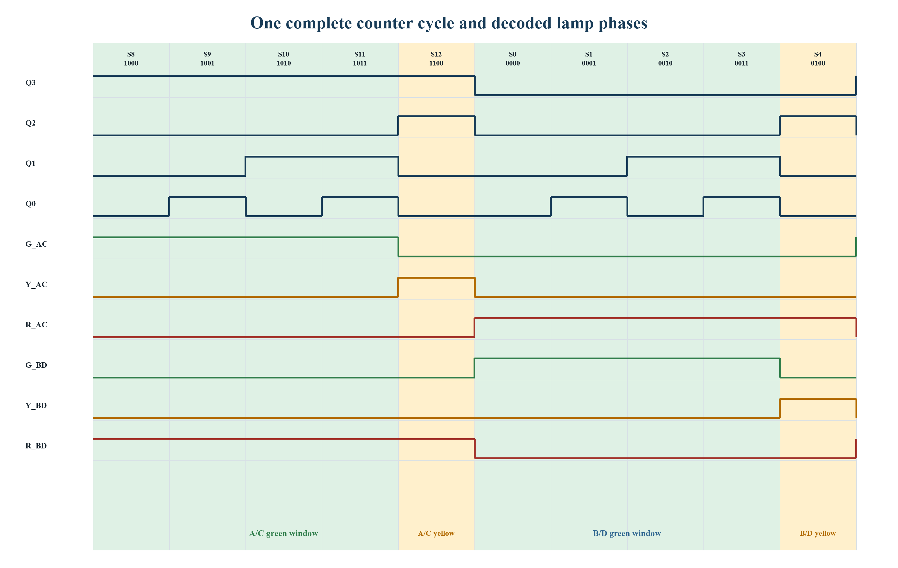
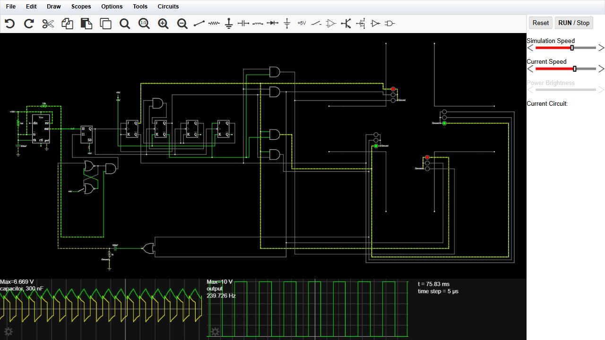
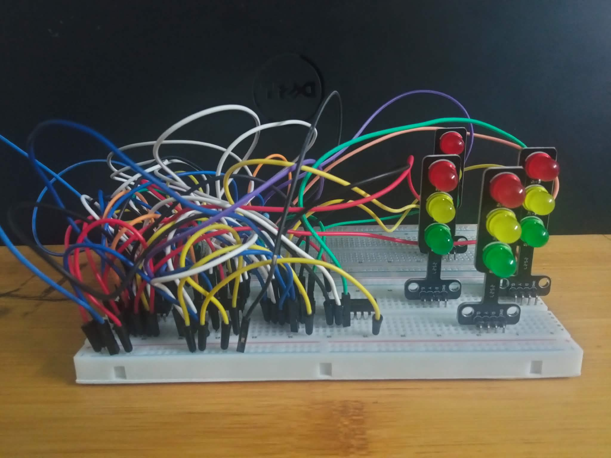

<p align="center">
  
</p>

<p align="center">
  <a href="https://github.com/lhlizdabezt/DienTuSo/releases/latest"></a>
  
  
  
</p>

<p align="center">
  <a href="https://youtu.be/cp_W2NxVCSE">Video demonstration</a> |
  <a href="simulation/roundabout-final-link.txt">CircuitJS launch link</a> |
  <a href="docs/video-narration.md">Video narration</a> |
  <a href="https://github.com/lhlizdabezt/DienTuSo/releases/latest">Report and slides</a>
</p>

# Roundabout Traffic-Light Controller

This repository documents a two-person Digital Electronics course project at the University of Science, Vietnam National University Ho Chi Minh City. The circuit controls four roundabout approaches without a microcontroller or programmable logic device. It combines an NE555 clock, an automatic/manual clock selector, four JK flip-flops, a minimized output decoder, CircuitJS simulation, and a breadboard prototype.

The final controller uses the 10-state sequence `8, 9, 10, 11, 12, 0, 1, 2, 3, 4`. Approaches A/C share one phase and approaches B/D share the opposing phase. The decoder makes the two green phases mutually exclusive.

> This is an educational prototype and not a certified controller for public-road deployment.

## Project status

| Review item | Status | Evidence |
|---|---|---|
| Counter and decoder equations | Verified | Node.js test covers the valid cycle, unused-state recovery, and green-phase exclusion |
| Circuit behavior | Demonstrated | Importable CircuitJS source and launch link |
| Physical implementation | Documented | Original breadboard photographs and recorded demonstration |
| Seminar report | Passed | 52 of 52 automated document checks |
| Public deliverables | Published | Versioned release with report, slides, submission bundle, and source snapshot |

<p align="center">
  
</p>

<p align="center"><em>Figure 1. Ten-state 4-1-4-1 sequence. The animation contains no moving connector lines.</em></p>

## System design

<p align="center">
  
</p>

<p align="center"><em>Figure 2. Gate-level architecture of the automatic/manual controller.</em></p>

The selected clock drives a four-bit JK state counter. Combinational logic decodes the two most significant state bits into the paired traffic-light outputs.

| Phase | Valid states | A/C output | B/D output | Duration |
|---|---:|---|---|---:|
| A/C movement | 8, 9, 10, 11 | Green | Red | 4 counts |
| A/C clearance | 12 | Yellow | Red | 1 count |
| B/D movement | 0, 1, 2, 3 | Red | Green | 4 counts |
| B/D clearance | 4 | Red | Yellow | 1 count |

<p align="center">
  
</p>

<p align="center"><em>Figure 3. Valid state cycle and paired signal phases.</em></p>

## Logic model

For a JK flip-flop, the next-state relation is `Q+ = JQ' + K'Q`. Karnaugh-map minimization gives the following counter inputs:

| Flip-flop | J input | K input |
|---|---|---|
| Q3 | `J3 = Q2` | `K3 = Q2` |
| Q2 | `J2 = Q1 Q0` | `K2 = 1` |
| Q1 | `J1 = Q0` | `K1 = Q0` |
| Q0 | `J0 = Q2'` | `K0 = 1` |

The paired output decoder is:

| Signal group | Green | Yellow | Red |
|---|---|---|---|
| A/C | `G_AC = Q3 Q2'` | `Y_AC = Q3 Q2` | `R_AC = Q3'` |
| B/D | `G_BD = Q3' Q2'` | `Y_BD = Q3' Q2` | `R_BD = Q3` |

Therefore, `G_AC G_BD = 0` for every four-bit input. The implementation also maps each unused state to the valid cycle after one selected clock edge.

<p align="center">
  
</p>

<p align="center"><em>Figure 4. JK excitation maps and minimized expressions.</em></p>

<p align="center">
  
</p>

<p align="center"><em>Figure 5. Counter state and decoder-output timing across one complete cycle.</em></p>

## Simulation and hardware evidence

| CircuitJS model | Breadboard prototype |
|---|---|
|  |  |
| Final gate-level simulation with clock selection, JK counter, decoder, and signal outputs. | Physical course prototype used for automatic-cycle and manual-step demonstrations. |

The evidence records functional behavior in the documented course setup. It does not constitute environmental, reliability, or road-safety certification.

## Reproduce the checks

Requirements: Git, Node.js 18 or later, and Python 3.10 or later. The required Python packages are pinned in `requirements.txt`.

```powershell
git clone https://github.com/lhlizdabezt/DienTuSo.git
Set-Location .\DienTuSo
python -m pip install -r .\requirements.txt
node .\tools\circuitjs-local\verify-seminar-logic.js
```

Expected output:

```text
PASS: 10 valid state transitions follow the 4-1-4-1 sequence.
PASS: 6 unused states recover to the valid sequence in one clock edge.
PASS: all 16 decoder inputs preserve mutually exclusive green phases.
```

Open the final simulation on Windows:

```powershell
.\start-circuitjs-seminar.cmd
```

Alternatively, open CircuitJS and import [`simulation/roundabout-final-circuit.txt`](simulation/roundabout-final-circuit.txt).

Regenerate the repository visuals:

```powershell
python .\scripts\generate_report_figures.py
python .\scripts\render_assets.py
```

Run the final-report QA check when the release DOCX is available at the repository root:

```powershell
python .\scripts\qa_roundabout_docx.py
```

## Repository map

```text
assets/
  seminar/                    Final diagrams and hardware photographs
docs/
  video-narration.md          Compact and extended demonstration scripts
simulation/
  roundabout-final-circuit.txt  Importable CircuitJS source
  roundabout-final-link.txt     Hosted CircuitJS launch URL
scripts/                      Figure generation, visual rendering, and QA tools
tools/circuitjs-local/
  verify-seminar-logic.js     Deterministic counter and decoder verification
requirements.txt              Pinned Python dependencies for visuals and DOCX QA
RELEASE_NOTES.md              Version history and release scope
```

## Academic context

| Field | Detail |
|---|---|
| Course | Digital Electronics, ETC00002 |
| Class | 25DTV_DKD3 |
| Academic year | 2025-2026 |
| Instructor | Dr. Bùi Trọng Tú |
| Team | Lương Hải Long, 22207056; Đoàn Minh Nhật, 24207030 |
| Institution | Faculty of Electronics and Telecommunications, VNUHCM - University of Science |

## Release deliverables

The [latest release](https://github.com/lhlizdabezt/DienTuSo/releases/latest) is the review package. It includes:

- the verified seminar report in DOCX format;
- the presentation deck in PPTX format;
- the complete seminar submission bundle, including the recorded demonstration; and
- a source snapshot tied to the release tag.

## Frequently asked questions

### Why are there ten states in a four-bit counter?

The design allocates four counts to each green phase and one count to each yellow phase. The resulting 4-1-4-1 schedule requires ten states, while four flip-flops provide the necessary state capacity.

### What does manual mode do?

The selector replaces the free-running oscillator path with a gated manual-step path. This allows a reviewer to advance and inspect one state at a time without changing the counter logic.

### How is conflicting green prevented?

The decoder expressions depend on complementary values of `Q3`. A/C green requires `Q3 = 1`, while B/D green requires `Q3 = 0`; both cannot be true simultaneously.

### Where are the complete report and video?

Use the [latest GitHub release](https://github.com/lhlizdabezt/DienTuSo/releases/latest) for downloadable files and the [YouTube demonstration](https://youtu.be/cp_W2NxVCSE) for a browser-based review.

## Author contact

**Lương Hải Long** - Electronics and Telecommunications student, VNUHCM - University of Science

| Channel | Link |
|---|---|
| Work email | [luonghailong.work@gmail.com](mailto:luonghailong.work@gmail.com) |
| Student email | [22207056@student.hcmus.edu.vn](mailto:22207056@student.hcmus.edu.vn) |
| Telephone / Zalo | [+84 988 114 708](tel:+84988114708) |
| LinkedIn | [linkedin.com/in/lhlizdabezt](https://www.linkedin.com/in/lhlizdabezt) |
| Facebook | [facebook.com/wageseadrake](https://www.facebook.com/wageseadrake) |
| Instagram | [instagram.com/lhlizdabezt](https://www.instagram.com/lhlizdabezt) |
| YouTube | [youtube.com/@lhlizdabezt](https://www.youtube.com/@lhlizdabezt) |
| TikTok | [tiktok.com/@wageseadrake](https://www.tiktok.com/@wageseadrake) |
| GitHub profile | [github.com/lhlizdabezt](https://github.com/lhlizdabezt) |
