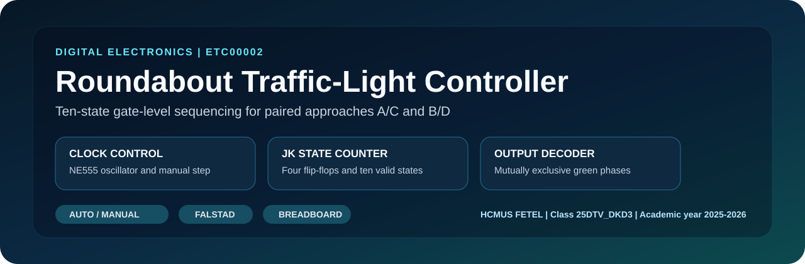
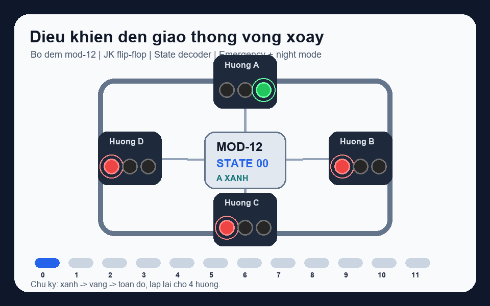

# 🚦 Điều khiển đèn giao thông vòng xoay bằng mạch số

<p align="center">
  
</p>

<p align="center">
  <a href="https://github.com/lhlizdabezt/DienTuSo/releases/latest"></a>
  <a href="https://github.com/lhlizdabezt/DienTuSo"></a>
  
  
</p>

<p align="center">
  
</p>

## Tóm tắt

Đây là project Điện tử số mô phỏng bộ điều khiển đèn giao thông cho vòng xoay 4 hướng. Thiết kế dùng chu kỳ 12 trạng thái, bộ đếm mod-12, flip-flop JK, cổng logic tổ hợp, chế độ khẩn cấp toàn đỏ và chế độ ban đêm nháy vàng. Mạch được dựng bằng Falstad/CircuitJS, có script kiểm thử logic bằng Node.js và có video demo trong GitHub Release.

Project được đóng gói theo hướng reviewer có thể đọc nhanh: sơ đồ mô phỏng, bảng trạng thái, script kiểm thử, ảnh/GIF minh họa và release asset tách riêng cho video/report.

## Điểm nổi bật kỹ thuật

| Hạng mục | Nội dung |
|---|---|
| Bài toán | Điều khiển đèn giao thông vòng xoay 4 hướng A, B, C, D |
| Kiến trúc | Bộ đếm mod-12, giải mã trạng thái, logic ưu tiên chế độ |
| Linh kiện logic | JK flip-flop, cổng AND/OR/NOT, LED mô phỏng, clock, reset |
| Chế độ thường | Mỗi hướng lần lượt xanh, vàng, sau đó toàn đỏ trước khi chuyển hướng |
| Chế độ khẩn cấp | Tất cả hướng chuyển đỏ để khóa giao thông |
| Chế độ ban đêm | Tất cả hướng nháy vàng theo xung clock |
| Mô phỏng | Falstad/CircuitJS local, import được bằng file text |
| Kiểm thử | `verify-roundabout-logic.js` kiểm tra 12 trạng thái, emergency và night mode |

## Logic vận hành

| Trạng thái | Pha | Hướng A | Hướng B | Hướng C | Hướng D |
|---:|---|---|---|---|---|
| 0 | A xanh | Xanh | Đỏ | Đỏ | Đỏ |
| 1 | A vàng | Vàng | Đỏ | Đỏ | Đỏ |
| 2 | Toàn đỏ | Đỏ | Đỏ | Đỏ | Đỏ |
| 3 | B xanh | Đỏ | Xanh | Đỏ | Đỏ |
| 4 | B vàng | Đỏ | Vàng | Đỏ | Đỏ |
| 5 | Toàn đỏ | Đỏ | Đỏ | Đỏ | Đỏ |
| 6 | C xanh | Đỏ | Đỏ | Xanh | Đỏ |
| 7 | C vàng | Đỏ | Đỏ | Vàng | Đỏ |
| 8 | Toàn đỏ | Đỏ | Đỏ | Đỏ | Đỏ |
| 9 | D xanh | Đỏ | Đỏ | Đỏ | Xanh |
| 10 | D vàng | Đỏ | Đỏ | Đỏ | Vàng |
| 11 | Toàn đỏ | Đỏ | Đỏ | Đỏ | Đỏ |

## Cấu trúc repo

| Đường dẫn | Vai trò |
|---|---|
| `roundabout_traffic_light_controller_falstad_stable_counter.txt` | Mạch Falstad/CircuitJS bản ổn định để import trực tiếp |
| `roundabout_traffic_light_controller_falstad_demo_clean.txt` | Bản demo sạch, dễ mở trong trình mô phỏng |
| `tools/circuitjs-local/circuits/` | Bản mạch dùng cho server CircuitJS local |
| `tools/circuitjs-local/start-demo.js` | Server local mở mô phỏng bằng URL nén `ctz` |
| `tools/circuitjs-local/verify-roundabout-logic.js` | Kiểm thử truth table cho chu kỳ thường, khẩn cấp và ban đêm |
| `start-circuitjs-demo.cmd` | Lệnh Windows mở demo sạch |
| `start-circuitjs-stable-counter.cmd` | Lệnh Windows mở bản counter ổn định |
| `assets/` | Banner SVG, GIF chuyển động và ảnh preview đã kiểm tra |

## Chạy kiểm thử logic

```powershell
node .\tools\circuitjs-local\verify-roundabout-logic.js
```

Kỳ vọng cuối cùng:

```text
OK: normal cycle, emergency mode, and night mode passed.
```

## Mở mô phỏng CircuitJS/Falstad

```powershell
.\start-circuitjs-demo.cmd
```

Hoặc mở bản counter ổn định:

```powershell
.\start-circuitjs-stable-counter.cmd
```

Sau khi chạy, script sẽ mở trình duyệt tại `http://127.0.0.1:8008/demo` hoặc port kế tiếp nếu port đang bận.

## Minh chứng

| Loại artifact | Nội dung |
|---|---|
| GIF motion | `assets/roundabout-motion.gif` mô phỏng thứ tự 12 pha |
| Ảnh mô phỏng | `assets/circuitjs-preview.png` chụp từ CircuitJS local |
| Video demo | Đính kèm trong [GitHub Release](https://github.com/lhlizdabezt/DienTuSo/releases/latest) |
| Báo cáo | File Word báo cáo được đưa vào release asset để repo gọn |
| Mạch import | File `.txt` có thể import vào Falstad/CircuitJS |

## Phạm vi trung thực

Đây là project học phần Điện tử số và mô phỏng logic, không phải bộ điều khiển giao thông dùng trong môi trường thật. Thiết kế tập trung vào giải mã trạng thái, kiểm tra chu kỳ đèn, mô phỏng chế độ ưu tiên và đóng gói artifact để người xem có thể chạy lại.

## Tác giả

| Trường | Thông tin |
|---|---|
| Họ tên | Lương Hải Long |
| MSSV | 22207056 |
| Trường | Trường Đại học Khoa học Tự nhiên - Đại học Quốc gia Thành phố Hồ Chí Minh |
| Ngành | Điện tử Viễn thông |
| GitHub | [github.com/lhlizdabezt](https://github.com/lhlizdabezt) |
| LinkedIn | [linkedin.com/in/lhlizdabezt](https://www.linkedin.com/in/lhlizdabezt) |
